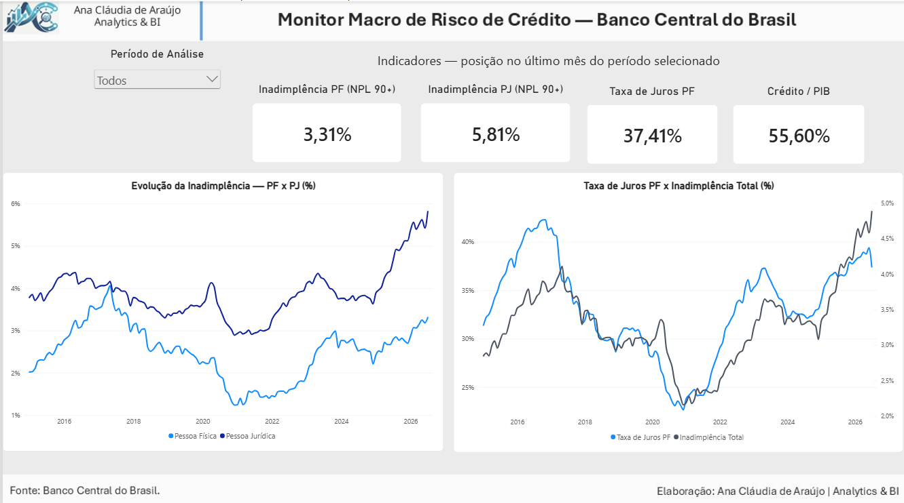

# 📊 Monitor Macro de Risco de Crédito — Banco Central do Brasil

## 📌 Sobre o Projeto

Projeto de análise de dados desenvolvido para acompanhar indicadores relacionados ao mercado de crédito no Sistema Financeiro Nacional (SFN), utilizando séries temporais disponibilizadas pelo Banco Central do Brasil.

O dashboard permite analisar a evolução da inadimplência de Pessoas Físicas (PF) e Pessoas Jurídicas (PJ), a trajetória da taxa de juros de crédito para Pessoas Físicas e a relação entre o crédito e o PIB.

Os indicadores apresentados nos cartões representam a posição no último mês disponível do período selecionado.

## 🎯 Objetivo

Construir um painel executivo que permita acompanhar, de forma simples e visual, a evolução de indicadores relevantes para a análise macro do risco de crédito no Brasil.

O projeto permite explorar:

- evolução da inadimplência de PF e PJ;
- comportamento da taxa de juros de crédito para PF;
- evolução da inadimplência total;
- relação entre crédito e PIB;
- comportamento dos indicadores ao longo do tempo.

## 🗂️ Fonte dos Dados

Os dados foram obtidos por meio da API do Sistema Gerenciador de Séries Temporais (SGS) do Banco Central do Brasil.

A base utilizada contém observações mensais e foi estruturada para análise temporal no Power BI.

## 🛠️ Tecnologias Utilizadas

- **Python**
  - Pandas
  - Requests
  - coleta de dados via API
  - tratamento e organização das séries temporais

- **Power BI**
  - modelagem dos dados
  - tabela calendário
  - relacionamentos
  - construção do dashboard

- **DAX**
  - criação de medidas
  - indicadores de posição no último período disponível
  - uso de `LASTNONBLANKVALUE`
  - medidas para análise das séries temporais

## 📊 Indicadores do Dashboard

O painel apresenta quatro indicadores principais:

- **Inadimplência PF (NPL 90+)**
- **Inadimplência PJ (NPL 90+)**
- **Taxa de Juros PF**
- **Crédito / PIB**

Além dos indicadores, o dashboard apresenta:

- evolução histórica da inadimplência de PF e PJ;
- comparação entre a Taxa de Juros PF e a Inadimplência Total;
- filtro por período de análise.

## 🔎 Principais Observações

A análise visual das séries evidencia diferentes ciclos no mercado de crédito ao longo do período analisado.

Observa-se que:

- a inadimplência de PF e PJ apresenta comportamentos distintos ao longo do tempo;
- a inadimplência de PJ apresenta períodos de maior oscilação;
- taxa de juros e inadimplência apresentam movimentos que podem ser comparados temporalmente no dashboard;
- o indicador Crédito/PIB permite acompanhar a evolução relativa do crédito na economia.

Essas observações são descritivas e não implicam, por si só, relação causal entre os indicadores.

## ⚙️ Fluxo do Projeto

API SGS / Banco Central do Brasil  
↓  
Coleta dos dados com Python  
↓  
Tratamento e consolidação das séries  
↓  
Exportação da base tratada  
↓  
Modelagem no Power BI  
↓  
Criação das medidas DAX  
↓  
Construção do dashboard

## 📷 Dashboard

## 📁 Arquivos do Projeto

- `coleta_bcb.ipynb` — coleta das séries históricas por meio da API do Banco Central.
- `Extracao_Tratamento.ipynb` — tratamento, organização e preparação dos dados.
- `base_risco_credito_bcb.csv` — base tratada utilizada na análise.
- `Credito_BCB.pbix` — dashboard desenvolvido no Power BI.
- `dashboard_preview.png` — visualização do dashboard final.

## 👩‍💻 Autoria

**Ana Cláudia de Araújo**  
Analytics & BI
